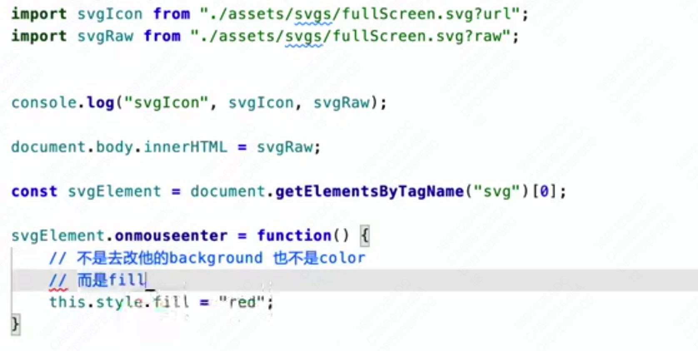

## 大纲

1. 什么是构建工具？
2. webpack的一个缺点在哪
3. es module的规范
4. vite他到底是什么东西
5. vite的基本安装和使用
6. vite的编译结果
7. vite编译结果的分析
8. vite的配置文件
9. vite中处理css，静态资源怎么去做
10. vite的插件以及常用用插件的使用
11. vite && ts
12. vite -> react,svelte, vue3
13. vite构建原理

## node库

- fs
- path

## CSS

> 在vite.config.js中我们通过css属性去控制真个vite对于css的处理行为

LocalConvention： 修改生成的配置对象的key的展示形式(驼峰还是中划线形式）
scopeBehaviour：配置当前的模块化行为是模块化还是全局化（有hash就是开启了模块化的一个标志，因为他可以保证产生不同的hash值来控制我们的样式类名不被覆盖）
generateScopedName：生成的类名的规则（可以配置为函数，也可以配置成字符串规则)
hashPrefix：生成hash会根据你的类名去进行生成，如果你想要你生成hash更加的独特一点，你可以配置hashPrefix，L

# vite配置文件中css配置流程(preprocessoroptions篇）

主要是用来配置css预处理的一些全局参数

# vite配置文件中css配置流程(postcss）
直接在css.postcss中进行配置，该属性直接配置的就是postcss的配置
postcss-preset-env：支持css变量和一些未来css语法 自动补全(autoprefixer)

## Node 与 fs

node端去读取文件或者操作文件的时候，如果发现你用的是相对路径，则会去使用process.cwd()来进行对应的拼接

process.cwd：获取当前的node执行目录

所以推荐使用 path 来获取路径

path.resolve(__dirname, '')

## Vite 对静态资源的处理

静态资源的定义：并不是只有图片，视频资源

出了动态API之外，99%的都是静态资源

Vite对静态资源的支持是 out of box 的

## resolve alias 原理
给我一个函数，模拟vite.config.js里alias配置的原理，函数的参数为aliasConfig和jsContent

```
type AliasConfig = {
  [key: string]: string;
};

/**
 * 模拟 Vite 配置文件中 alias 配置的原理
 * @param aliasConfig alias 配置对象
 * @param jsContent JavaScript 文件内容
 * @returns 转换后的 JavaScript 文件内容
 */
function simulateViteAlias(aliasConfig: AliasConfig, jsContent: string): string {
  // 遍历 aliasConfig 对象，替换 jsContent 中的对应别名
  Object.entries(aliasConfig).forEach(([alias, aliasValue]) => {
    // 使用正则表达式匹配并替换别名
    const aliasRegex = new RegExp(`import\\s+.*\\s+from\\s+['"]${alias}(/.*)?['"]`, 'g');
    jsContent = jsContent.replace(aliasRegex, (match, importPath) => {
      // 使用 path 模块处理路径
      const newPath = importPath ? path.join(aliasValue, importPath) : aliasValue;
      return match.replace(alias, newPath);
    });
  });

  return jsContent;
}
```

这个实现中，我们使用了 Object.entries 来遍历 aliasConfig 对象，并使用 path 模块处理路径。其他部分与之前的实现相同。

## vite 对 svg 的处理
svg: 可伸缩矢量图

特点：
1. 不会失真
2. 尺寸小
3. 无法很好的表现画面细节【缺点】

前端领域里，使用 SVG 作为图标



## Vite在生产环境中，对静态资源的处理

当我们将工程进行打包以后，会发现找不到原来的资源，配置baseUrl

打包后的静态资源为什么要有hash
浏览器是有一个缓存机制 静态资源名字只要不改，那么他就会直接用緩存的
我们要尽量避免名字一致

## 插件【重点】

Vite 会在**生命周期的不同阶段**，去调用**不同的插件**以达到不同目的

中间件，和插件类似

### vite-aliases

---

Vite 插件是基于 Rollup 插件 系统设计的，它们可以扩展 Vite 的功能，例如处理不同类型的文件、优化构建等。Vite 插件分为以下几个方面：

解析: Vite 插件可以自定义模块解析逻辑，例如处理别名或自定义文件扩展名。

// vite.config.js
import path from 'path';

export default {
  plugins: [
    {
      name: 'resolve-alias',
      resolveId(source) {
        if (source === '@alias') {
          return path.resolve(__dirname, 'src/alias');
        }
        return null;
      },
    },
  ],
};
加载: Vite 插件可以自定义加载文件内容，例如处理图片、样式等。

// vite.config.js
import fs from 'fs';

export default {
  plugins: [
    {
      name: 'load-image',
      load(id) {
        if (id.endsWith('.jpg')) {
          return `export default ${JSON.stringify(fs.readFileSync(id, 'base64'))}`;
        }
        return null;
      },
    },
  ],
};
转换: Vite 插件可以自定义转换文件内容，例如编译 TypeScript、处理 CSS 预处理器等。

// vite.config.js
import typescript from '@rollup/plugin-typescript';

export default {
  plugins: [
    typescript(),
  ],
};
优化: Vite 插件可以在构建阶段优化代码，例如压缩、拆分等。

// vite.config.js
import { terser } from 'rollup-plugin-terser';

export default {
  plugins: [
    terser(),
  ],
};
其他钩子: Vite 插件还提供了其他钩子，例如 buildStart、buildEnd、watchChange 等，用于在特定时机执行自定义操作。

// vite.config.js
export default {
  plugins: [
    {
      name: 'custom-hooks',
      buildStart() {
        console.log('Build started');
      },
      buildEnd() {
        console.log('Build ended');
      },
      watchChange(id) {
        console.log(`File changed: ${id}`);
      },
    },
  ],
};
以上就是 Vite 插件的主要方面，你可以根据项目需求选择合适的插件来扩展 Vite 的功能。
